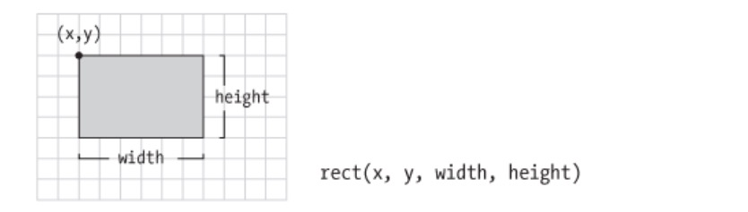

Liste de formes disponibles dans P5.js

Les 2D Primitives:

```
point()
line()
triangle()

// carrés et rectangles
square()
rect()
quad()

// formes rondes
circle()
ellipse()
arc()
```

Voir [la Référence P5.js](https://p5js.org/reference/)

Explications:


`line(30, 20, 85, 75);`





`ellipse(56, 46, 55, 55);`

Les paramètres 1 et 2 définissent le centre de l'ellipse.  
Les paramètres 3 et 4 donnent la largeur et hauteur.


